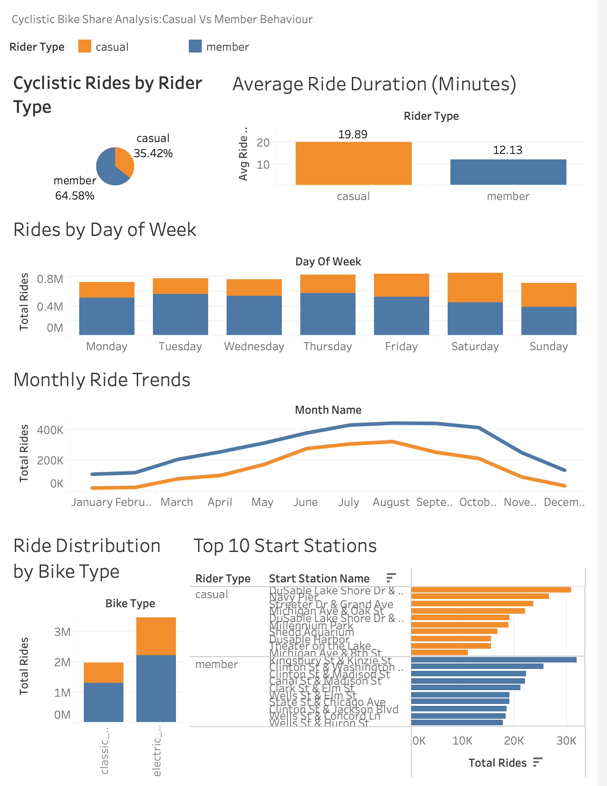
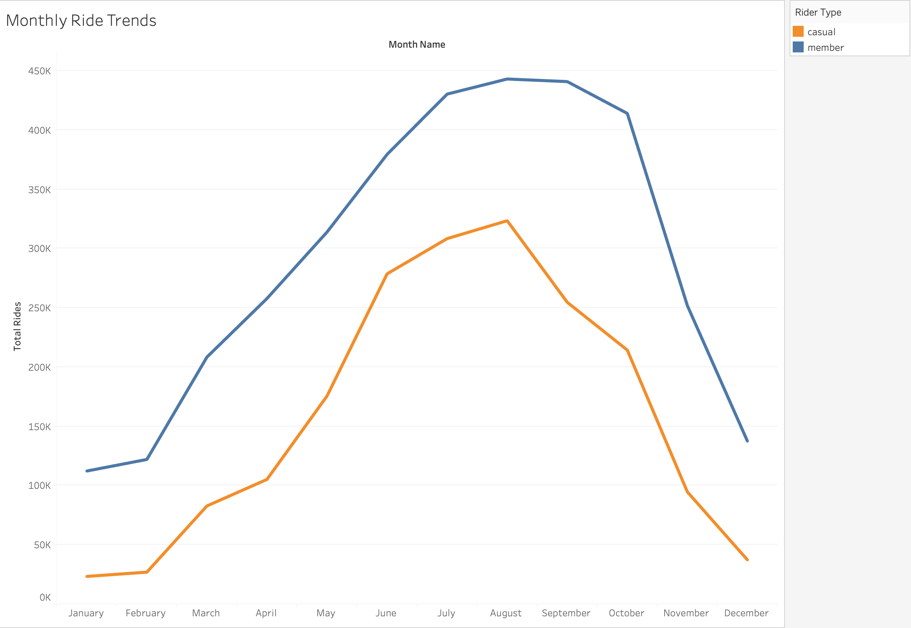

# Cyclistic Bike-Share Analysis

### Google Data Analytics Professional Certificate — Capstone Project

[](https://public.tableau.com/app/profile/bennett.ullah/viz/CyclisticDashboardBikeShareAnalysis-Tableau/Dashboard1)
[](https://github.com/bennettullah/cyclistic-bikeshare-analysis/blob/main/03_sql_scripts)
[](https://github.com/bennettullah/cyclistic-bikeshare-analysis/blob/main/LICENSE)

---

## Project Overview

This analysis examines 12 months of Cyclistic bike-share trip data (December 2024 — November 2025) to identify behavioural differences between casual riders and annual members, informing a data-driven marketing strategy to convert casual riders into annual members.

**Live Dashboard:** [View Interactive Dashboard on Tableau Public](https://public.tableau.com/app/profile/bennett.ullah/viz/CyclisticDashboardBikeShareAnalysis-Tableau/Dashboard1)

### Dashboard Preview

[](https://public.tableau.com/app/profile/bennett.ullah/viz/CyclisticDashboardBikeShareAnalysis-Tableau/Dashboard1)

[](https://public.tableau.com/app/profile/bennett.ullah/viz/CyclisticDashboardBikeShareAnalysis-Tableau/Dashboard1)

*Click either image to open the full interactive dashboard on Tableau Public*
---

## Business Task

> *How do annual members and casual riders use Cyclistic bikes differently?*

---

## Tools Used

| Tool | Purpose |
| --- | --- |
| SQLite / DBeaver | Database, data cleaning, analysis |
| Tableau Public | Visualisation & interactive dashboard |
| Terminal (Mac) | Automation & batch import |
| GitHub | Version control & portfolio hosting |

---

## Dataset

- **Source:** Motivate International Inc. (Divvy Bikes Chicago)
- **Period:** December 2024 — November 2025 (12 months)
- **Raw records:** 5,590,832 | **Clean records:** 5,438,912
- **Records removed:** 151,920 (false starts, unreturned bikes, impossible durations)
- **License:** [Motivate International Inc. Public Data License Agreement](https://divvybikes.com/data-license-agreement)

---

## Key Findings

| # | Finding | Impact |
| --- | --- | --- |
| 1 | Members account for **64.58%** of rides; casuals **35.42%** (1.9M trips) | Large conversion opportunity |
| 2 | Casual riders average **19.89 mins/trip** vs members **12.13 mins** — 64% longer | Different use cases confirmed |
| 3 | Casuals peak on **Saturday**; members peak **Tuesday–Thursday** | Completely opposite patterns |
| 4 | **47%** of casual rides occur June–August — extreme seasonality | Campaign timing: May–June |
| 5 | Casual top stations: tourist attractions (Navy Pier, Millennium Park) | Geo-targeting opportunity |
| 6 | Member top stations: transit hubs and business district intersections | Zero geographic overlap |

---

## Top 3 Recommendations

1. **Weekend Station Marketing** — Deploy signage at top casual stations on Friday evenings and Saturday mornings to reach riders at peak engagement.Success metric: 8% increase in new memberships at targeted stations within 90 days of campaign launch and track new memberships originating from targeted stations.
3. **Spring Membership Drive** — Launch a time-limited discounted annual membership promotion in May–June, before casual riders commit their peak-season spending to single-ride passes. Success metric: 10% uplift in May–June membership sales versus the prior 12-month monthly average and track conversion rate of casual riders entering peak season.
4. **Geofenced Digital Advertising** — Target mobile devices within 500m of the top 10 casual stations on weekends during May–October. Success metric: Cost-per-acquisition from geofenced campaign versus non-targeted digital advertising channels and track conversion rate from ad engagement to membership sign-up.

---

## Limitations

- The dataset does not include personally identifiable information (PII), so individual rider behaviour cannot be tracked across multiple trips.  
- It is not possible to directly confirm whether a specific casual rider converted into a member.  
These limitations mean results should be interpreted at an aggregate level rather than individual user level.

---

## Repository Structure
```
cyclistic-bikeshare-analysis/
├── 01_raw_data/                # Raw CSVs not committed — 12 monthly files exceed GitHub's 100MB limit
│                               # Source: https://divvy-tripdata.s3.amazonaws.com/index.html
├── 02_processed_data/          # Aggregated CSV exports for Tableau
│   ├── 01_rider_split.csv
│   ├── 02_avg_duration.csv
│   ├── 03_day_of_week.csv
│   ├── 04_monthly.csv
│   ├── 05_bike_type.csv
│   └── 06_top_stations.csv
├── 03_sql_scripts/             # All SQL scripts documented
│   ├── 01_create_table.sql     # Table creation DDL
│   ├── 02_data_cleaning.sql    # Quality checks + clean table
│   └── 03_analysis.sql         # Six analytical queries
├── LICENSE
└── README.md
```

---

## SQL Showcase

Analysis was performed across three scripts in SQLite via DBeaver: table creation, data cleaning, and six analytical queries against 5,438,912 clean records. Two techniques worth highlighting:

### Query 6 — Top 10 Start Stations per Rider Type
**Techniques:** CTE · `ROW_NUMBER() OVER(PARTITION BY)` · `TRIM()` for non-NULL blank handling
```sql
-- Business question: Where do casual riders start trips? Enables geo-targeting strategy.
-- Technique: ROW_NUMBER() OVER(PARTITION BY) returns top-N rows per group in a single pass.
-- TRIM() catches blank station names that passed the NULL check — a real data quality edge case.

WITH ranked_stations AS (
  SELECT
    member_casual AS rider_type,
    start_station_name,
    COUNT(*) AS total_rides,
    ROUND(AVG(ride_length_minutes), 2) AS avg_ride_minutes,
    ROW_NUMBER() OVER(
      PARTITION BY member_casual
      ORDER BY COUNT(*) DESC
    ) AS rank_within_group
  FROM cyclistic_trips_clean
  WHERE TRIM(start_station_name) != ''
  GROUP BY member_casual, start_station_name
)
SELECT
  rider_type,
  rank_within_group  AS rank,
  start_station_name,
  total_rides,
  avg_ride_minutes
FROM ranked_stations
WHERE rank_within_group <= 10
ORDER BY rider_type, rank_within_group;
```

**Result:** Zero overlap between casual and member top 10 stations — casual riders cluster at tourist destinations (Navy Pier, Millennium Park), members at transit hubs and business district intersections. This directly informed the geo-targeting recommendation.

---

### Query 5 — Bike Type Preference with Within-Group Percentages
**Technique:** `SUM(COUNT(*)) OVER(PARTITION BY member_casual)` for percentages within each rider type
```sql
-- Business question: Which bike types does each rider type prefer?
-- Technique: PARTITION BY member_casual calculates percentages within each group,
-- not against the total dataset — a key distinction for accurate segment analysis.

SELECT
  member_casual AS rider_type,
  rideable_type AS bike_type,
  COUNT(*) AS total_rides,
  ROUND(COUNT(*) * 100.0 /
    SUM(COUNT(*)) OVER(PARTITION BY member_casual), 2) AS pct_within_rider_type,
  ROUND(AVG(ride_length_minutes), 2) AS avg_ride_minutes
FROM cyclistic_trips_clean
GROUP BY member_casual, rideable_type
ORDER BY member_casual, total_rides DESC;
```

**Result:** Casual riders on classic bikes average **29.16 minutes** — the highest engagement of any segment. Despite electric bikes being more popular by volume (65%), classic bike casual riders are the deepest engagers in the entire dataset.

→ [View all six queries including Q1 window function and Q2 CTE](./03_sql_scripts/03_analysis.sql)

---

## Data Cleaning Summary

| Check | Finding | Action |
| --- | --- | --- |
| Duplicate ride_ids | 0 duplicates | No action required |
| NULL values (9 columns) | 0 NULLs | No action required |
| Zero/negative duration | 29 rides | Excluded |
| Rides under 1 minute | 146,319 rides | Excluded |
| Rides over 24 hours | 5,601 rides | Excluded |
| **Total removed** | **151,920** | |
| **Final clean dataset** | **5,438,912** | ✓ Ready for analysis |

---

## Key Metrics at a Glance

| Metric | Value |
| --- | --- |
| Total raw records | 5,590,832 |
| Total clean records | 5,438,912 |
| Member ride share | 64.58% |
| Casual ride share | 35.42% |
| Casual average ride duration | 19.89 minutes |
| Member average ride duration | 12.13 minutes |
| Duration difference | Casuals ride 64% longer |
| Peak casual day | Saturday (397,019 rides) |
| Peak member day | Thursday (566,999 rides) |
| Top casual station | DuSable Lake Shore Dr & Monroe St |
| Top member station | Kingsbury St & Kinzie St |

---
## About Me

Data Analyst with a background in financial services and customer operations, specialising in SQL, data cleaning, and translating data into business decisions that improve customer outcomes.

---
## Contact

- **LinkedIn:** [linkedin.com/in/bennettullah](https://www.linkedin.com/in/bennettullah)
- **Tableau Public:** [bennett.ullah on Tableau Public](https://public.tableau.com/app/profile/bennett.ullah/viz/CyclisticDashboardBikeShareAnalysis-Tableau/Dashboard1)
- **GitHub:** [github.com/bennettullah](https://github.com/bennettullah)
